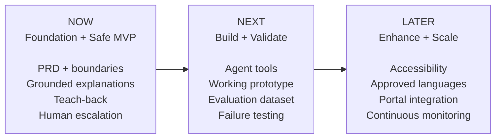

# CareBridge AI: Agent Product Roadmap

> **Portfolio status:** A bounded fictional-data prototype is implemented and verified but remains unpublished. This does not represent a deployed clinical system or achieved clinical outcomes.

## Implemented prototype snapshot

The original roadmap below is preserved as the product-planning artifact. The completed portfolio prototype implements a narrower, safety-bounded subset:

- Exact-source retrieval with explicit missing-data behavior
- Narrow rule-based Q&A with source evidence
- Grounded Gemini explanation workflow with deterministic refusal and post-generation validation
- Simulated clarification handoff, delivery/status states, retry/idempotency, compact audit history, and authored response fixtures
- Optional teach-back with deterministic safety rules, bounded meaning classification, one retry, fixed feedback, explicit simulated handoff, and no raw-response retention

Recorded verification: **25/25 teach-back**, **23/23 handoff/status**, and **24/24 browser interaction** checks. Existing **11/11 rule-Q&A**, **17/17 simulated grounding**, and **7/7 diagnostic/privacy** checks also pass.

The prototype uses fictional data only and remains unpublished. Authentication, reminders, real clinical messaging, durable governed audit storage, production integrations, and operational monitoring remain future work.

## Product vision

Help patients understand and follow clinician-approved discharge instructions while keeping diagnosis, treatment changes, and clinical judgment with licensed professionals.

## Visual roadmap

## Current portfolio progress

| Artifact | Status | Product-management evidence |
|---|---|---|
| Problem Discovery | Complete | User problem, target population, assumptions, and opportunity |
| AI Product Principles | Complete | Source-of-truth, human responsibility, and safety boundaries |
| AI Output Evaluation | Complete | Groundedness, completeness, clarity, and safety evaluation |
| Product Roadmap | Current | Prioritization, dependencies, validation gates, implemented scope, and future vision |
| Product Requirements Document | Reconciled | Original product intent plus implemented prototype scope and remaining gaps |
| Agent Boundary | Implemented for prototype | Authorized actions, prohibited actions, deterministic stops, and simulated escalation |
| Working Prototype | Complete, unpublished | Bounded workflow using fictional data |
| Evaluation Report | Complete for recorded prototype scope | Synthetic checks, bounded live cases, failure analysis, and limitations |

## NOW: Foundation and safe MVP

**Objective:** Prove that the product can safely improve understanding of clinician-approved activity restrictions.

### Capabilities

- Secure entry through an authenticated QR code or link
- Retrieval of one finalized, authorized discharge plan
- Original instructions displayed beside plain-language explanations
- First pilot focused on clinician-approved activity restrictions
- Short teach-back questions to check understanding
- Patient-selected reminders within clinician-approved parameters
- Escalation of conflicting, missing, or clinical questions
- Audit records containing sources, actions, escalation status, and delivery confirmation

### Safety gates

- No diagnosis, medication changes, new treatment instructions, or symptom interpretation
- No unrestricted access to clinical databases
- Minimum-necessary access enforced through authentication and authorization
- Recommendation-only prototype with no autonomous production clinical action
- Critical instruction changes or omissions must remain at zero in the pilot test set
- Cases requiring clinical judgment must be correctly escalated

## NEXT: Build and validate

**Objective:** Turn the approved workflow into a basic agent and test it against expected and failure scenarios.

### Capabilities

- Narrow agent tools for instruction retrieval, reminders, clinical handoff, and audit logging
- Structured tool inputs and outputs
- Human-approval and stopping rules
- Synthetic evaluation dataset
- Tests for unsupported claims, instruction conflicts, expired authentication, and tool failure
- Working prototype demonstrating the bounded agent loop
- Evaluation dashboard and pilot go/no-go recommendation

### Validation gates

- High clinician-reviewed explanation accuracy
- High recall for required clinical escalations
- Complete supporting evidence for every recommendation
- Confirmed handoff delivery before telling a patient that staff received the request
- Acceptable usability results from representative patient and staff testing

## LATER: Enhance and scale

**Objective:** Add value only after the MVP demonstrates safety, usefulness, and operational reliability.

### Candidate enhancements

- Multiple reading levels that preserve critical wording
- Clinically reviewed multilingual explanations
- Voice playback and accessibility controls
- Staff dashboard for unresolved questions and acknowledgment status
- Version tracking when source instructions change
- Integration with approved patient portals and clinical workflow systems
- Analytics identifying instructions patients frequently misunderstand
- Organization-configurable policies, content libraries, and escalation routes
- Continuous evaluation and controlled prompt or model updates

## Explicitly deferred

- Autonomous diagnosis or clinical triage
- Autonomous medication or care-plan changes
- Clinical instructions generated without an approved source
- Open-web medical information used for patient-specific answers
- Fully autonomous patient-record updates

## How features will be prioritized

Each proposed feature will be reviewed using four questions:

1. **User value:** Does it materially improve understanding, follow-through, accessibility, or staff response?
2. **Safety risk:** What harm could occur if it is wrong or unavailable?
3. **Dependencies:** What data, integration, policy, or operational capability must exist first?
4. **Evidence:** What test result would justify moving it forward?

The roadmap is a living product artifact. Features may move between **NOW**, **NEXT**, and **LATER** as evaluation evidence and stakeholder feedback develop.
