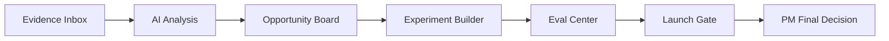

# ProductTrace: Problem Discovery

## Problem

Product Managers receive fragmented evidence from many sources:

- Customer interviews
- Support tickets
- NPS comments
- Bug reports
- Stakeholder requests
- Product usage signals
- Later roadmap phase: external market and competitive research

The difficulty is not simply collecting evidence. The harder problem is turning that evidence into defensible product decisions without losing traceability.

Common failure modes include:

- Loud stakeholder requests outweighing broader customer evidence
- AI-generated recommendations sounding credible without source support
- Teams jumping directly from feedback to feature development
- Product decisions becoming disconnected from original evidence
- Experiments being launched without complete metrics or guardrails
- AI features reaching production without explicit evaluation criteria
- Human product judgment being obscured by automation

## Target user

### Primary
Product Manager

### Secondary
- Product Owner
- UX Researcher
- Product Operations
- Engineering lead
- Business Analyst
- Customer Success lead

## Product hypothesis

If Product Managers can connect every insight, opportunity, experiment, and launch decision back to source evidence, then they can make faster AI-assisted decisions while preserving accountability and human judgment.

## Core product principle

> Every AI-assisted conclusion should remain traceable to the evidence that produced it.

## User need

A PM should be able to answer:

1. What are users telling us?
2. What patterns exist?
3. What evidence supports those patterns?
4. What product opportunity follows from the evidence?
5. What did the AI propose?
6. What did the PM change?
7. What should be tested?
8. How will success and failure be measured?
9. Is the AI output reliable enough to use?
10. Is the opportunity actually ready to progress?

## Why ProductTrace is not intended to be a thin AI wrapper

The system keeps durable product logic outside the model:

- Persistent evidence records
- Provenance and citations
- PM decision states
- Prioritization inputs
- Experiment definitions
- Evaluation suites
- Governance thresholds
- Audit history
- Launch-readiness rules
- Explicit human approval

AI accelerates analysis and synthesis; it does not own product state or final product decisions.

## MVP workflow

## Non-goals for V1

- Autonomous roadmap management
- Automatic launch approval
- Production-grade multi-user collaboration
- Enterprise integrations
- Revenue forecasting
- Full market-intelligence ingestion
- Live customer analytics integrations
- Replacement of customer research

## Current product-learning question

Can a structured evidence-to-decision workflow make AI-assisted product analysis more trustworthy than a conventional prompt-and-response experience?

ProductTrace V1 is being built specifically to test that question.
