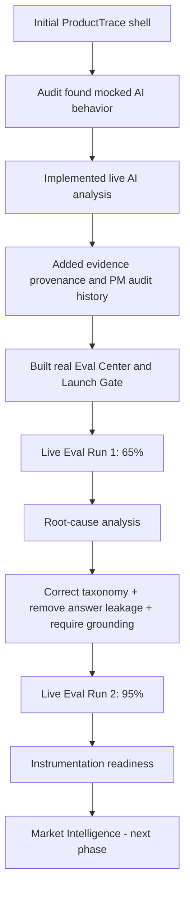

# ProductTrace — Build Retrospective

## Why this document exists

The ProductTrace build is intentionally documented as an iterative product process rather than a polished-after-the-fact success story.

The most useful evidence came from what failed.

## Build timeline

## Stage 1 — Polished workflow, weak implementation truth

The first prototype looked credible and demonstrated the intended product flow.

A structured audit found that several key AI capabilities were still seeded or deterministic:

- Analysis did not truly analyze newly added evidence
- Evaluation runs replayed fixed outcomes
- Decision History was mostly simulated
- Traceability was incomplete

### Product decision

Do not polish around the problem.

The build was redirected toward implementation truth:
- live AI
- persistent evidence
- exact citations
- real decision auditing

## Stage 2 — Live AI and provenance

The next iteration introduced:

- Live evidence analysis
- Dynamic themes
- Supporting evidence IDs
- Exact supporting excerpts
- Citation validation state
- Immutable original AI proposal
- PM-approved current wording
- PM rationale
- Prioritization history
- Automatic experiment draft creation

This moved ProductTrace away from a thin prompt wrapper toward a stateful decision system.

## Stage 3 — Real evaluation

The Eval Center was rebuilt so active cases executed real model behavior.

The first genuine live run produced:

- 65% overall pass
- 70% classification accuracy
- 85% grounding
- 0% unsupported recommendations
- 0% execution errors
- 4/4 critical cases passed

The product did **not** meet its own thresholds.

## Stage 4 — Root-cause analysis

Inspection of the failed cases found that the model was not the only problem.

### Evaluation-design defects

Several expected labels were wrong.

Examples:
- upload recovery labeled as search
- search failure labeled as notifications
- dashboard latency labeled as onboarding

### Taxonomy defect

Free-form labels caused semantically reasonable model output to fail exact-string scoring.

### Grounding defect

Empty citations were allowed.

### Leakage defect

The model received the expected theme during evaluation.

## Stage 5 — Corrective changes

The team corrected the evaluation design rather than lowering thresholds.

Changes:
- Corrected mislabeled cases
- Controlled canonical taxonomy
- Removed expected answer from model input
- Required grounding
- Versioned the workflow
- Preserved the first run unchanged

## Stage 6 — Measured improvement

The second genuine live run produced:

- **95% overall pass**
- **95% classification accuracy**
- **100% grounding**
- **0% unsupported recommendations**
- **0% execution errors**
- **0 critical failures**
- 19 PASS / 1 FAIL / 0 ERROR

Improvement:
- +30 points overall
- +25 points classification
- +15 points grounding

## Important non-improvement

Theme label collision increased from 20% to 25%.

This was not hidden.

The remaining failure became another product-learning signal rather than a reason to manipulate thresholds.

## Stage 7 — Launch readiness

Evaluation governance now passes.

Remaining V1 launch prerequisites are human/product-process items:

- Explicit PM problem validation
- Explicit PM experiment approval
- Instrumentation readiness
- Final PM decision

## Key PM lessons

1. A good-looking AI interface can mask incomplete product behavior.
2. Evals need their own validation.
3. A failed model score may expose a bad taxonomy rather than a bad model.
4. Grounding should be enforced structurally.
5. Expected answers should not leak into evaluation prompts.
6. Governance thresholds should not move simply because a product failed them.
7. Immutable history makes iteration credible.
8. Human approval should remain visible in AI-assisted workflows.
9. Product instrumentation is part of launch readiness, not an afterthought.

## Portfolio significance

ProductTrace demonstrates a full PM iteration loop:

**Requirement → Build → Audit → Failure → Root cause → Product change → Re-evaluation → Governance**

That build process is as important to the portfolio as the final UI.
