# ProductTrace — Visual Walkthrough

This gallery tells the ProductTrace story from evidence intake through AI synthesis, PM governance, experimentation, market intelligence, discovery, and the decision to request more discovery rather than force an opportunity forward.

## 1. Evidence → AI synthesis

### Evidence Inbox
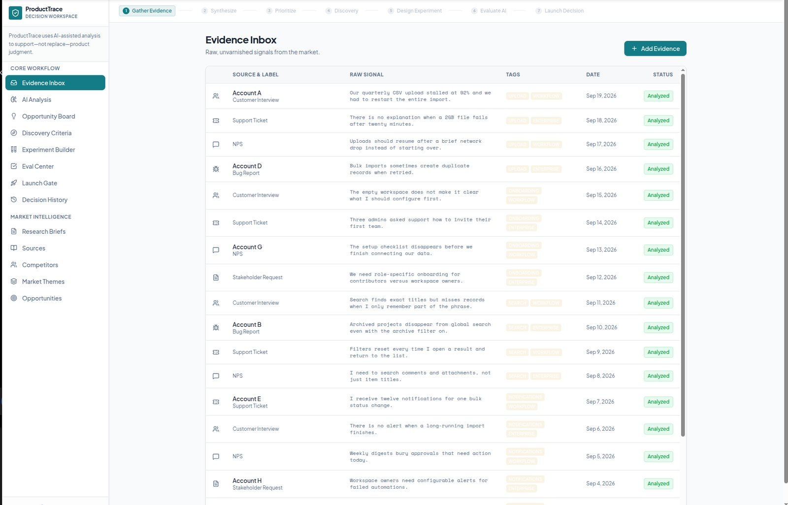

Raw customer and product signals are captured with source, date, tags, and analysis status before synthesis.

### AI Analysis
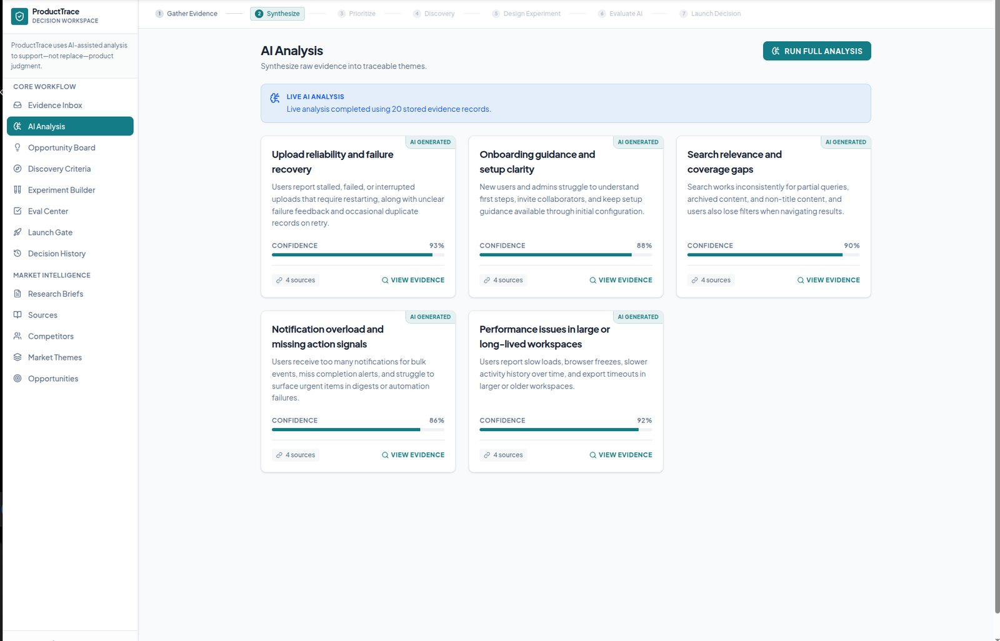

Live AI groups evidence into traceable themes with confidence and supporting-source links.

## 2. AI proposal → PM judgment

### Opportunity Board
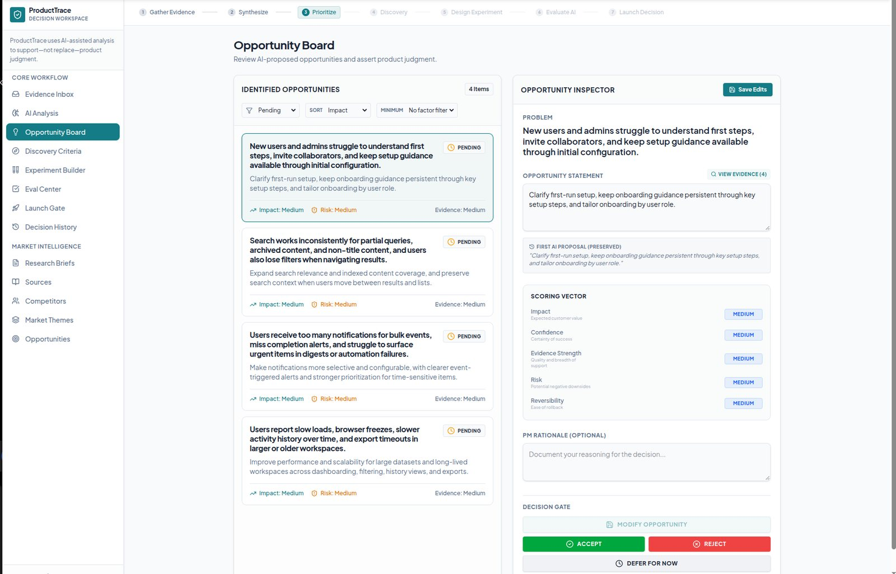

The PM can review the AI proposal, inspect evidence and decision dimensions, edit the opportunity, and explicitly Accept, Reject, Modify, or Defer.

### Discovery Criteria
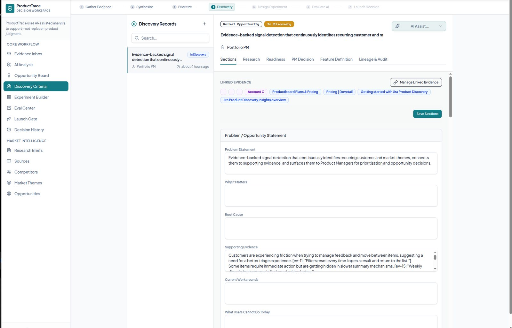

Structured discovery separates evidence-backed content from unresolved questions instead of allowing a plausible opportunity to become an automatic commitment.

## 3. Experiment design → instrumentation

### Experiment Design
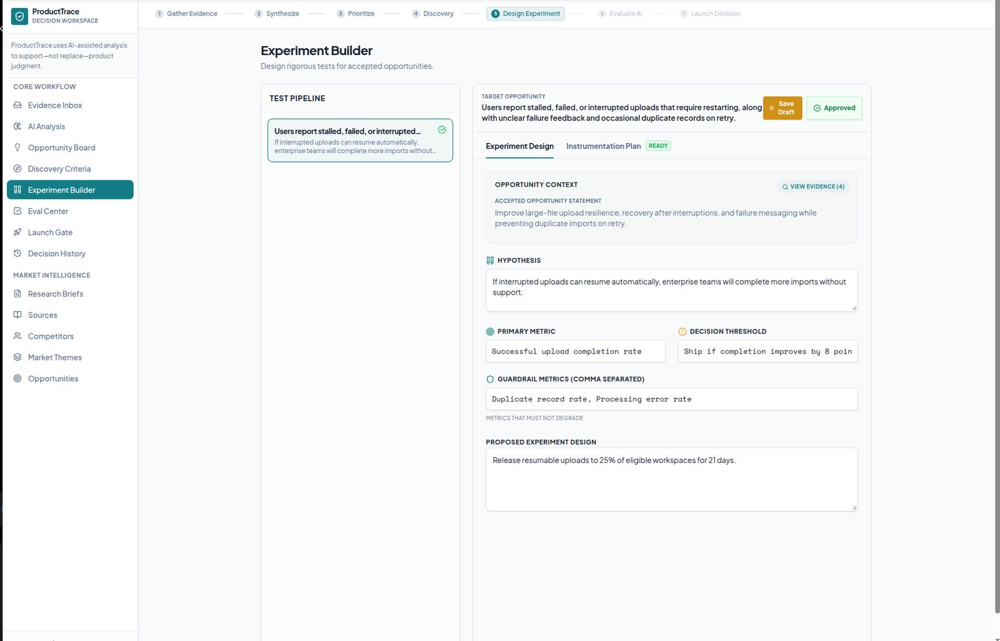

The approved experiment captures hypothesis, primary metric, guardrails, decision threshold, design, and linked evidence.

### Instrumentation Plan
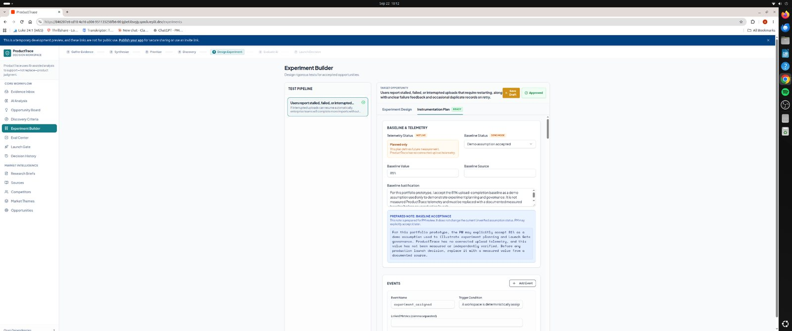

Instrumentation distinguishes planned telemetry from measured telemetry and preserves the demo-baseline assumption rather than presenting it as production evidence.

## 4. AI evaluation → launch governance

### Eval Center
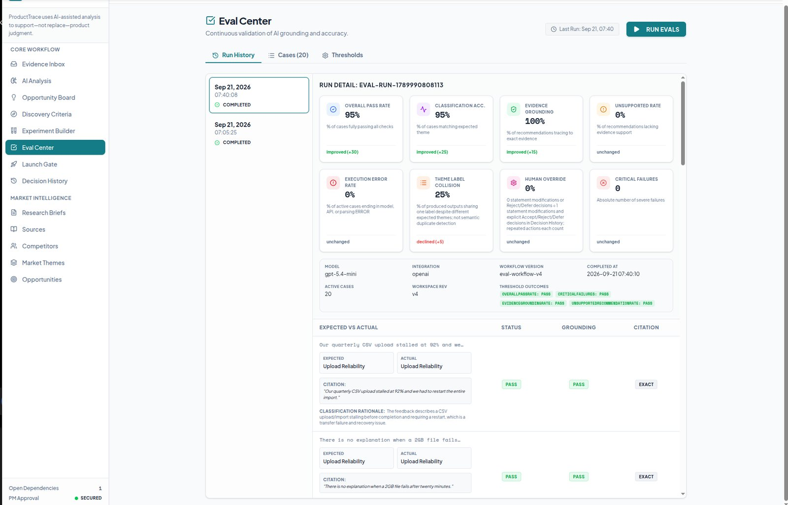

The second live evaluation reached **95% overall pass**, **95% classification accuracy**, and **100% evidence grounding**, with **0% unsupported recommendations** and **0 critical failures**.

### Launch Gate
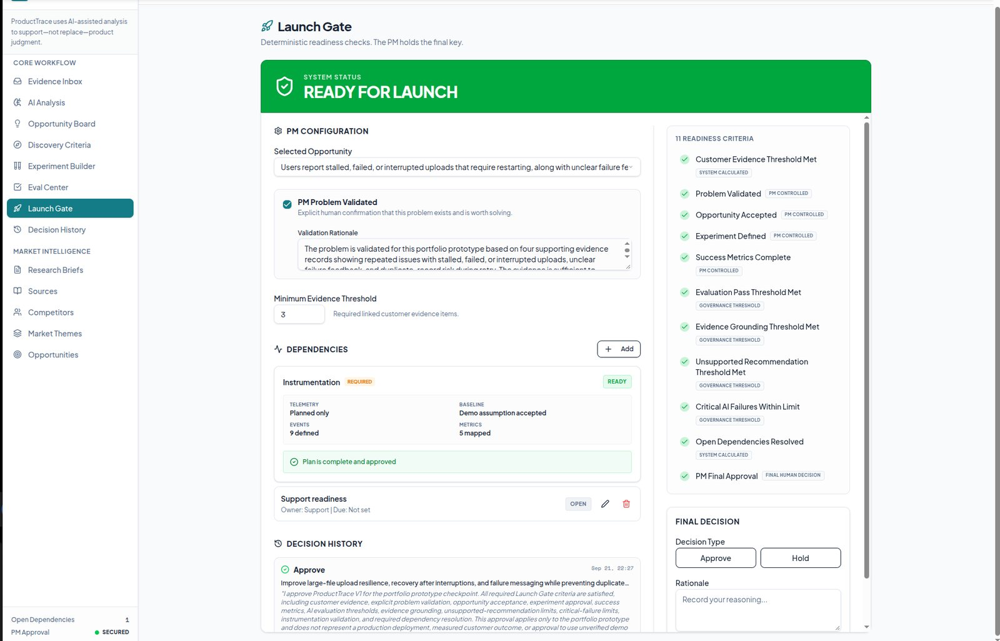

Launch eligibility is deterministic, while final approval remains an explicit PM decision. Instrumentation readiness, AI evaluation, evidence, dependencies, and human approval are independently visible.

## 5. Market Intelligence

### Verified Market Sources
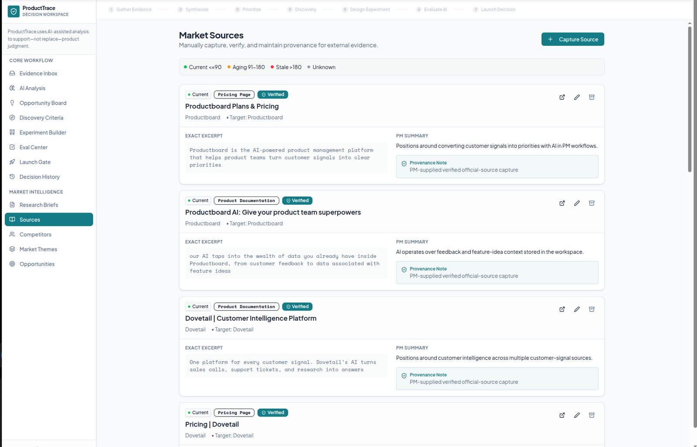

External evidence preserves exact excerpts, source provenance, freshness, verification status, and PM interpretation.

### Market Themes
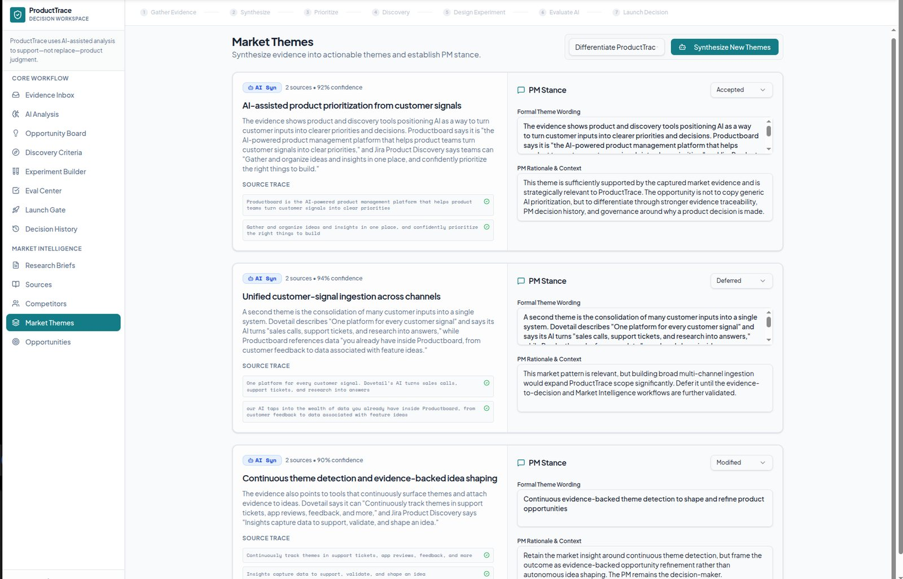

AI-generated Market Themes remain subject to human disposition. The same screen shows **Accepted**, **Deferred**, and **Modified** PM stances.

### Market Opportunity
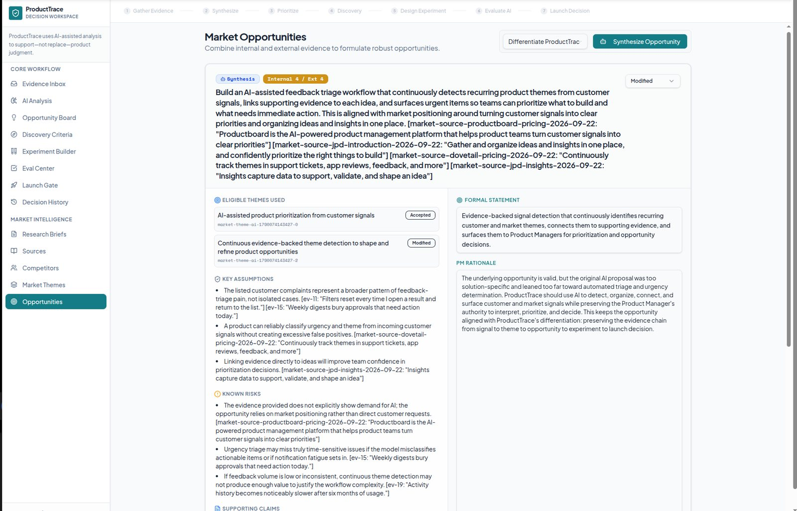

Internal and external evidence are combined into a grounded opportunity while the original AI proposal, PM-modified statement, assumptions, risks, and rationale remain visible.

## 6. Discovery governance

### Discovery Readiness
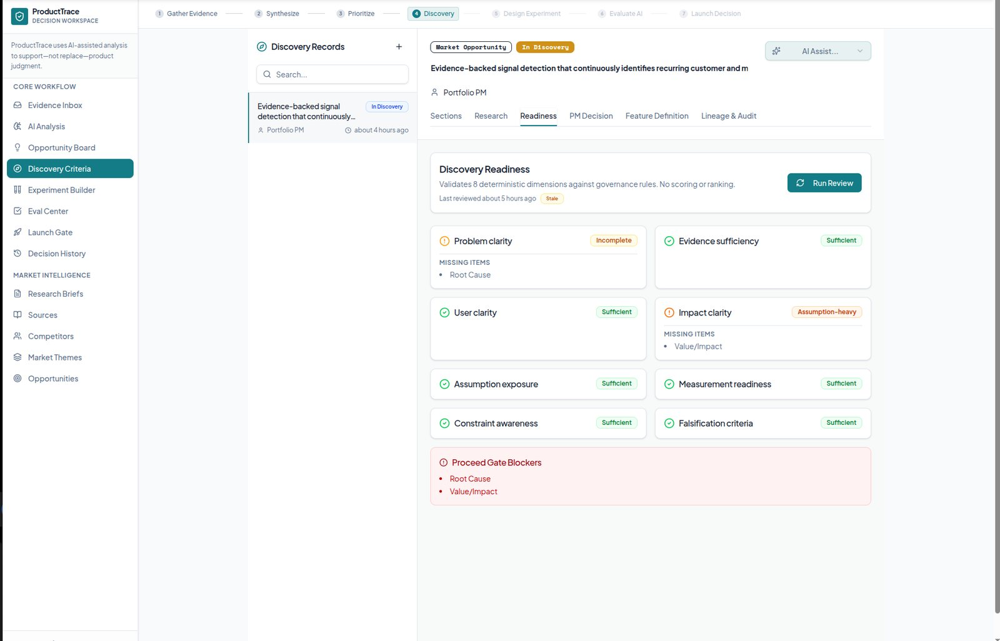

Readiness is dimension-based rather than reduced to an opaque score. Root Cause and Value/Impact remain visible blockers.

### More Discovery Needed
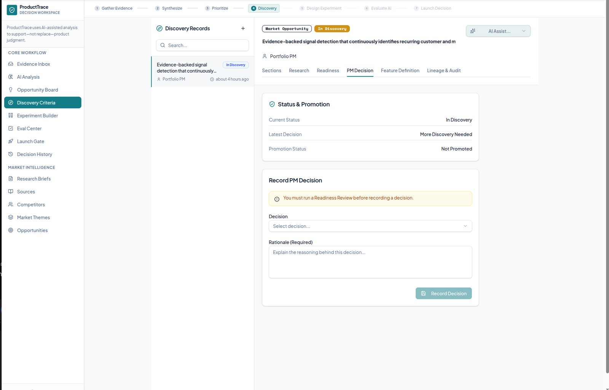

The first live Discovery case remained **In Discovery**, with the PM decision **More Discovery Needed** and no formal promotion.

### Falsification Checks
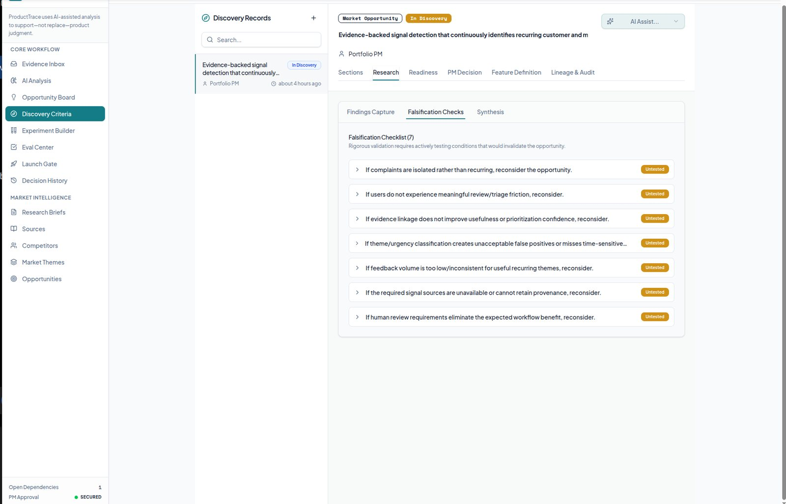

Discovery includes explicit conditions that could weaken or invalidate the opportunity, not only evidence that supports building.

### Research Finding Capture
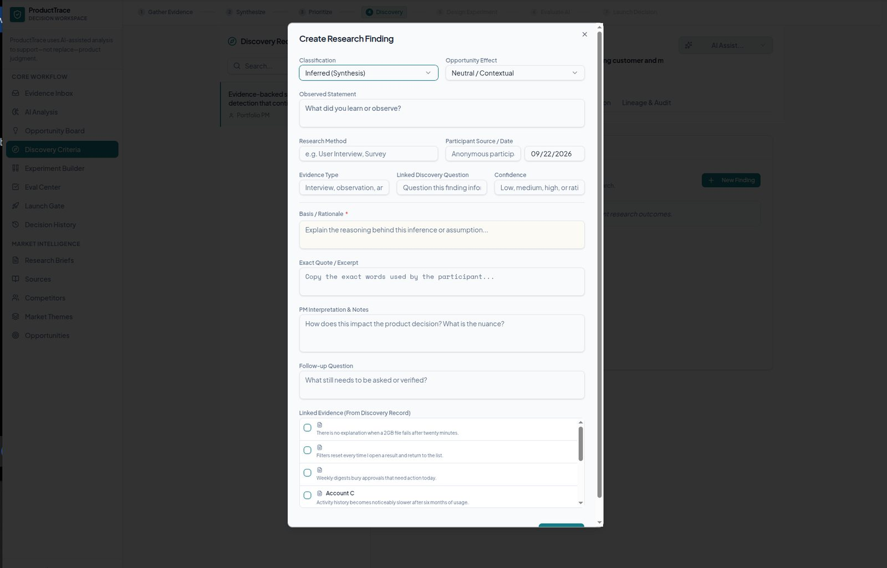

The research-entry workflow is ready for real testing, with fields for classification, research method, source, exact quote, confidence, evidence linkage, PM interpretation, and follow-up questions. No synthetic research findings were entered.

---

## Visual architecture

> **AI proposes. Evidence supports. Discovery reduces uncertainty. The Product Manager decides.**
