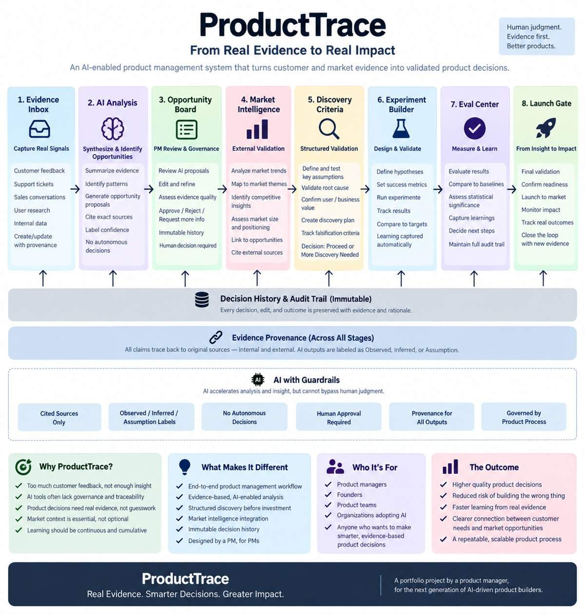
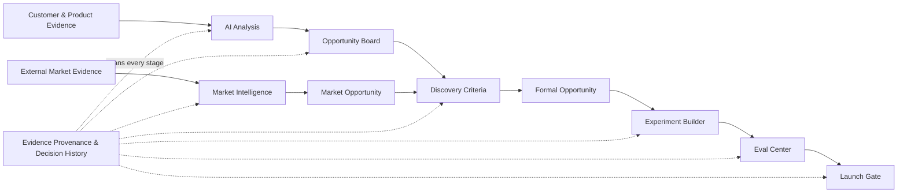

# ProductTrace AI

> **From customer signal to product decision — with the evidence attached.**

ProductTrace is an AI-assisted evidence-to-decision system for Product Managers. It connects customer evidence, market evidence, AI synthesis, structured discovery, experiment design, evaluation, and launch governance while preserving the evidence and human decision history behind each step.\n\n

**Portfolio status:** **Development frozen — final capstone build**

---

## Project at a glance

| Area | Final state |
| --- | --- |
| Engineering | **43/43 API regression tests passed**; API/frontend typechecks and production builds passed |
| Live AI evaluation | **65% → 95% overall pass rate** after root-cause remediation |
| Evidence grounding | **85% → 100%** |
| Unsupported recommendations | **0%** in both recorded live eval runs |
| Critical eval failures | **0** in final run |
| Instrumentation validation | **30/30 synthetic assertions passed** |
| V1 Launch Gate | **10/10 eligibility criteria passed** |
| Final V1 PM decision | **Approve** — portfolio prototype checkpoint only |
| Market Intelligence | 12 verified external sources, 3 competitors, 3 Market Themes, 1 grounded Market Opportunity |
| Discovery Criteria | First live case ended **More Discovery Needed** because Root Cause and Value/Impact remain unvalidated |
| Development freeze | **Approved** — no high- or medium-severity defects |

---

## Product architecture

### Governance principle

> **AI proposes. Evidence supports. Discovery reduces uncertainty. The Product Manager decides.**

AI assists with synthesis, classification, drafting, and evaluation. It does **not** autonomously validate problems, approve opportunities, approve experiments, approve discovery, promote formal opportunities, or make the final launch decision.

---

## Why ProductTrace exists

AI can generate product ideas quickly, but speed alone creates risks:

- unsupported recommendations
- weak source provenance
- hidden assumptions
- over-automation
- false confidence
- loss of PM accountability

ProductTrace is designed around the opposite standard: **evidence first, explicit uncertainty, visible human decisions, and an immutable audit trail.**

---

## Key product proof points

### 1. Failed AI evaluation was preserved — not hidden

The first live Eval Center run scored:

| Metric | Run 1 | Run 2 |
| --- | ---: | ---: |
| Overall pass rate | 65% | **95%** |
| Classification accuracy | 70% | **95%** |
| Evidence grounding | 85% | **100%** |
| Unsupported recommendation rate | 0% | **0%** |
| Execution error rate | 0% | **0%** |
| Critical cases passed | 4/4 | **4/4** |

The audit found taxonomy mismatch, invalid expected labels, exact-string scoring problems, missing citations, and expected-label leakage. Those issues were remediated **without lowering governance thresholds**.

### 2. Instrumentation stayed honest about what was synthetic

The V1 experiment instrumentation plan defined 9 events and 5 metric mappings.

Synthetic validation passed **30/30 assertions with zero violations**.

ProductTrace still labels telemetry as **Planned only** and does not present synthetic validation as production evidence.

### 3. Market Intelligence added external evidence without surrendering PM control

The workflow expanded to:

**Research Brief → Verified Sources → Competitor Context → Market Themes → Market Opportunity**

Official-source research was captured with exact excerpts and provenance. A negative governance control correctly blocked Market Opportunity synthesis before a PM accepted or modified a Market Theme.

### 4. Discovery Criteria stopped an attractive opportunity from advancing too early

The first live Discovery record inherited real internal and external evidence, but ProductTrace still concluded:

**More Discovery Needed**

The unresolved items were substantive:

- validated Root Cause
- validated user/business Value and Impact

The system deliberately did **not** turn an evidence-backed hypothesis into product commitment.

---

## Start here

For a fast portfolio review:

1. **[Final Portfolio Case Study](20-Final-Portfolio-Case-Study.md)** — complete product story
2. **[Final Architecture & Workflow](14-Final-Architecture-and-Workflow.md)** — system design and governance
3. **[2–3 Minute Demo Script](16-Demo-Script.md)** — interview/demo walkthrough
4. **[Interview Talking Points](18-Interview-Talking-Points.md)** — AI PM discussion prompts
5. **[First Live Discovery Case](13-First-Live-Discovery-Case.md)** — why the system chose More Discovery Needed
6. **[Development Freeze](17-Development-Freeze.md)** — final engineering verification\n7. **[Visual Walkthrough](21-Visual-Walkthrough.md)** — recruiter-friendly screenshot tour

---

## Artifact library

### Product foundation

- [01 — Problem Discovery](01-Problem-Discovery.md)
- [02 — Product Requirements Document](02-Product-Requirements-Document.md)
- [05 — Product Roadmap](05-Product-Roadmap.md)

### AI evaluation, experimentation & launch governance

- [03 — AI Evaluation and Governance](03-AI-Evaluation-and-Governance.md)
- [04 — Build Retrospective](04-Build-Retrospective.md)
- [06 — Instrumentation Plan](06-Instrumentation-Plan.md)
- [07 — Instrumentation Validation](07-Instrumentation-Validation.md)
- [08 — V1 Launch Decision](08-V1-Launch-Decision.md)

### Market Intelligence

- [09 — Market Intelligence Research Brief](09-Market-Intelligence-Research-Brief.md)
- [10 — Market Source Register](10-Market-Source-Register.md)
- [11 — Market Intelligence Audit](11-Market-Intelligence-Audit.md)

### Discovery Criteria

- [12 — Discovery Criteria Design](12-Discovery-Criteria-Design.md)
- [13 — First Live Discovery Case](13-First-Live-Discovery-Case.md)

### Portfolio closeout

- [14 — Final Architecture & Workflow](14-Final-Architecture-and-Workflow.md)
- [15 — Final Build Retrospective](15-Final-Build-Retrospective.md)
- [16 — 2–3 Minute Demo Script](16-Demo-Script.md)
- [17 — Development Freeze](17-Development-Freeze.md)
- [18 — Interview Talking Points](18-Interview-Talking-Points.md)
- [19 — Portfolio Screenshot Plan](19-Portfolio-Screenshot-Plan.md)
- [20 — Final Portfolio Case Study](20-Final-Portfolio-Case-Study.md)\n- [21 — Visual Walkthrough](21-Visual-Walkthrough.md)

---

## Working prototype

**Replit project:** https://replit.com/replid/846207e6-cd18-4a16-a306-951135258fb6

The prototype is **development frozen**. Future product activity is intentionally limited to:

- real user-led research
- evidence entry from actual testing
- evidence-based iteration
- bug fixes discovered during real use
- portfolio presentation polish

No additional major feature phase is planned.

---

## Portfolio standard

ProductTrace intentionally preserves failed evaluations, audit findings, assumptions, synthetic-versus-live distinctions, and decisions to stop or request more discovery.

The objective is not to present a perfect first build. It is to demonstrate **product judgment, responsible AI governance, measurable iteration, and evidence-based decision-making.**
